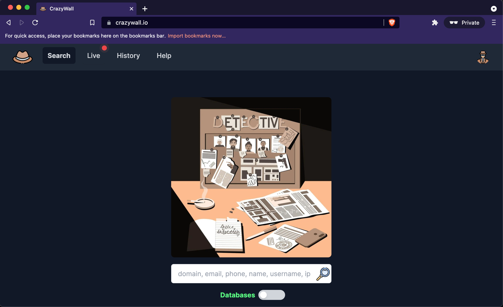
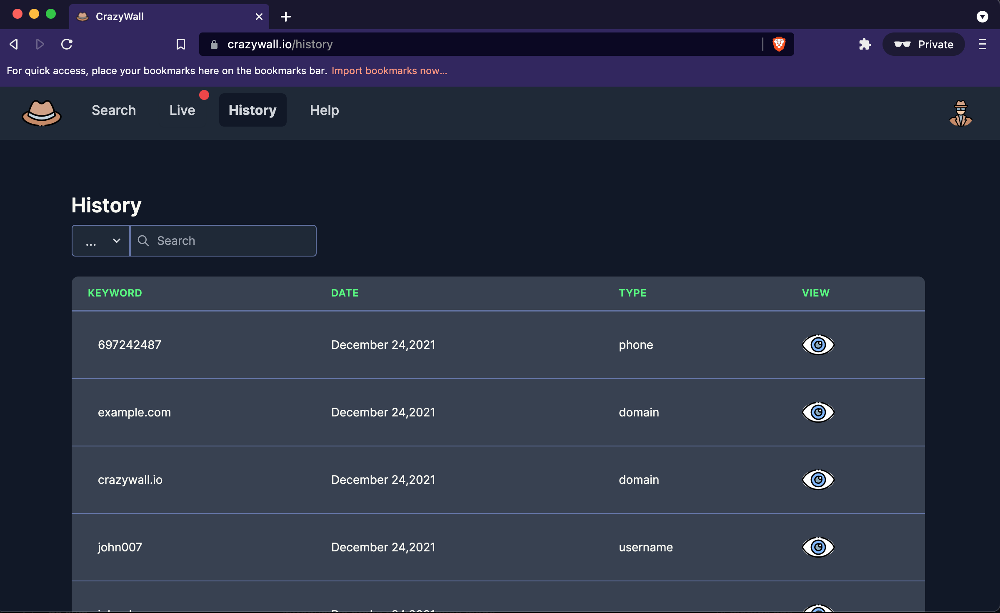
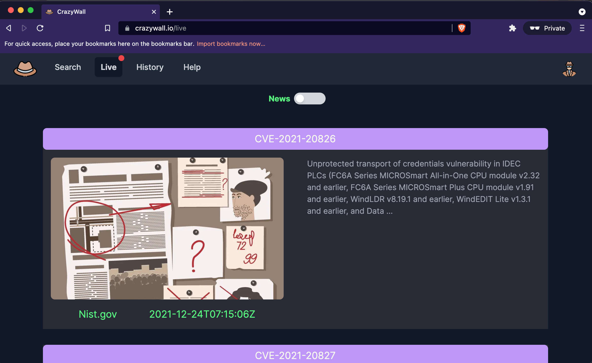
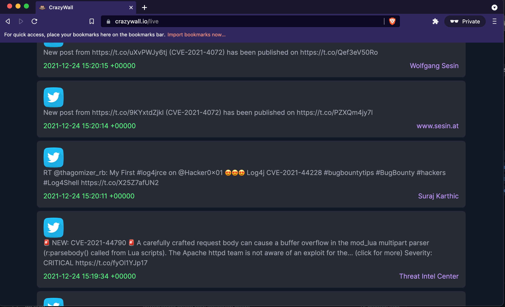
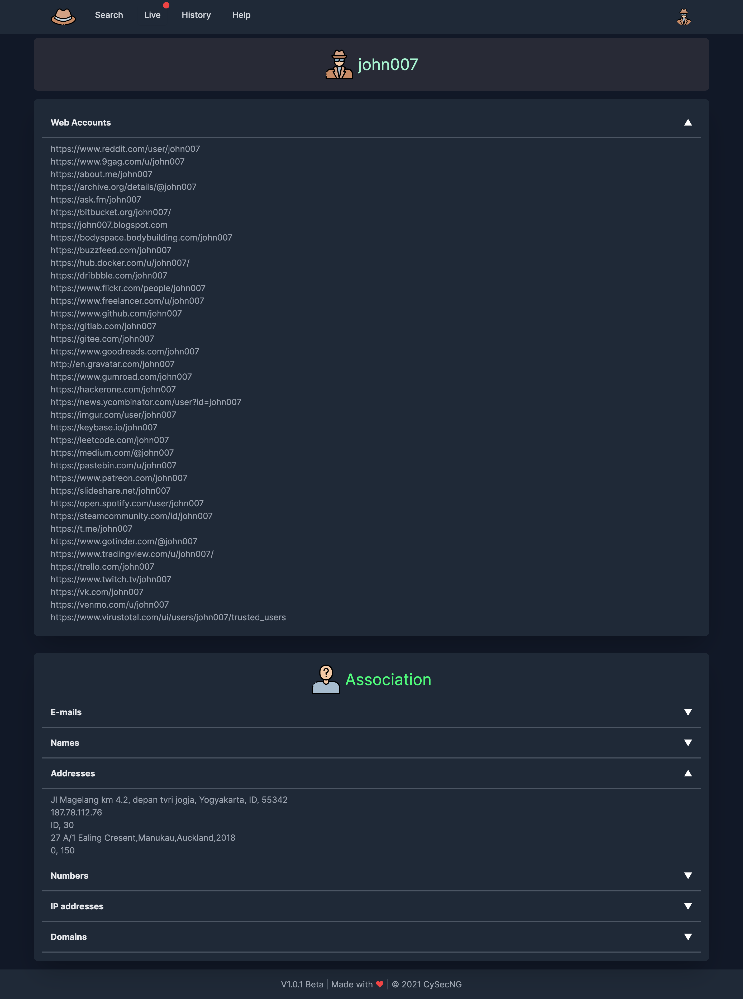
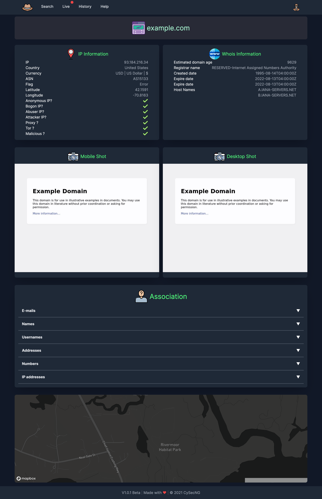

# Welcome to CrazyWall


Think of CrazyWall as a digital evidence board. It accepts and treats different user inputs, namely IP address, username, full name, domain name. after detecting and processing your input based on your input, it returns different data.
The complete writeup is available<strong> [here.](https://0xsha.io/blog/introducing-cloudbrute-wild-hunt-on-the-clouds) </strong>

## Demo

[](https://www.youtube.com/watch?v=2u1D9Wvr0AI)


## How to use it?

All you have to do is go to the main page, type your keyword, select your mode between databases and live and hit the enter button. Valid inputs are : a domain name, e.g., `domain.com` a phone number (international format), e.g., `00123456789` a full name, e.g., `john due` a user name, e.g., `sherlock` an IP address, e.g., `1.2.3.4` a keyword for live search, e.g., `crypto`. Please watch the demo for complete usage.

## ScreenShots 

<strong>Search</strong>

 

<strong>Search</strong>



<strong>Live News</strong>



<strong>Live Social</strong>



<strong>UserName Data</strong>



<strong>Site Data</strong>




## Motivation 

The primary motivation was to create a PoC toward incredible real-time threat intel; the original plan was to re-write this (cut out the external APIs and add their functionality to the back-end as an engine) embed it into our [Suite](https://huntersuite.io). Then decided to release a chunk of research as a standalone suite in front of you called CrazyWall. 


## Feature 
- Hand-picked sources: data sources are synergized  
- Cross-data-search: getting all associations, like addresses, e-mails, phone numbers, etc., with a particular entity.
- Stand alone API: gathers all external resources under a unified, simple-to-use API to feed/pipe them to your existing toolkit or machine learning models <strong>without the need to use the front end.</strong>

## Data Sources
- [Phoneinfoga](https://github.com/sundowndev/phoneinfoga)
- [Dehashed](https://www.dehashed.com)
- [C99](https://c99.nl)
- [Sherlock](https://github.com/sherlock-project/api)
- [Whoisxmlapi](https://www.whoisxmlapi.com/)
- [Wappalyzer](https://www.wappalyzer.com/)
- [SocialSearcher](https://www.social-searcher.com/)
- [NewsApi](https://newsapi.org/)

## Version
1.0.0

## Development
in this section, you can learn how this tool is developed and deployed.


## Front-End 
The front-end is developed using `Vue.js 2.x` / `Nuxt.js`; all you have to do is make sure you install `Node.js 14+` on your target machine. 
Go to the front-end directory. It uses client-side rendering and static site generation as it requires no SEO and brings complete separation from the back-end.

Using yarn:

Dev:
``` 
yarn
yarn dev
```

Build:
```
yarn build 
yarn start
```

using npm 

Dev:
```
npm i 
npm run dev 
```

Build:
```
npm run build 
npm run start
```


## Back-End 

The back-end is developed in Golang, using `Fiber` and `Gorm` and `MySQl8`. To work on the back-end, you have to install golang `1.16+` to get the same hot-reloading as the front-end while developing; you can do the following. To start back-end, you need to copy the `.env.example` file to `.env` and then obtain the required API. A majority of them offer a free API. check out data source section for more information.

Using fiber CLI
```
fiber dev
```

## The deployment 

you can deploy it using managed or manual. <strong>Please note that this project is meant to be a PoC, so you are responsible for thoroughly reviewing and testing the code before use in any non-testing environment.</strong>


## Managed 
For managed services, which are more painless, you can use `Heroku`, `Google App Engine`, `AWS Elastic Beanstalk`, `DigitalOcean App Platform`. They all have app detection, and you can follow their guides on how to deploy `Golang`, `NodeJS`, and `MySql8`.


## Manual 

Here is an example of manual deployment on Ubuntu `20.04`. install `Nginx`, `Node 14+` and `Golang 13+` using `apt`. 

### Nginx

Here is an example of the Nginx configuration with let's encrypt `(certbot)` SSL, which handles both front-end and API. 

```nginx
map $sent_http_content_type $expires {
    "text/html"                 epoch;
    "text/html; charset=utf-8"  epoch;
    default                     off;
}

server {             # the port Nginx is listening on
    server_name     crazywall.io www.crazywall.io;    # setup your domain here

    gzip            on;
    gzip_types      text/plain application/xml text/css application/javascript;
    gzip_min_length 1000;

    location / {
        expires $expires;

        proxy_redirect                      off;
        proxy_set_header Host               $host;
        proxy_set_header X-Real-IP          $remote_addr;
        proxy_set_header X-Forwarded-For    $proxy_add_x_forwarded_for;
        proxy_set_header X-Forwarded-Proto  $scheme;
        proxy_read_timeout          1m;
        proxy_connect_timeout       1m;
        proxy_pass                          http://127.0.0.1:3000;
    }

    listen 443 ssl; # managed by Certbot
    ssl_certificate /etc/letsencrypt/live/crazywall.io/fullchain.pem; # managed by Certbot
    ssl_certificate_key /etc/letsencrypt/live/crazywall.io/privkey.pem; # managed by Certbot
    include /etc/letsencrypt/options-ssl-nginx.conf; # managed by Certbot
    ssl_dhparam /etc/letsencrypt/ssl-dhparams.pem; # managed by Certbot


}

server {
    server_name api.crazywall.io;

    location / {
        proxy_pass http://localhost:3333;
    }


    listen 443 ssl; # managed by Certbot
    ssl_certificate /etc/letsencrypt/live/crazywall.io/fullchain.pem; # managed by Certbot
    ssl_certificate_key /etc/letsencrypt/live/crazywall.io/privkey.pem; # managed by Certbot
    include /etc/letsencrypt/options-ssl-nginx.conf; # managed by Certbot
    ssl_dhparam /etc/letsencrypt/ssl-dhparams.pem; # managed by Certbot

}
```

### Front-End persitance service 

`touch /etc/systemd/system/front.service`

```
[Unit]
After=network.service
Description="Front End"
[Service]
# current working directory (where your app lives)
WorkingDirectory=/root/app/crazymap-frontend

# setting ENV variables
Environment=NODE_ENV=production BASE_URL=https://api.crazywall.io

# start your app with the command
ExecStart=yarn start

# always restart the app if it crashes
Restart=always

# if the crash happens, wait 3 seconds before restarting
RestartSec=3

# Run this service automatically after boot:
[Install]
WantedBy=multi-user.target

```


Back-end persistent service

`touch /etc/systemd/system/api.service`

```
[Unit]
Description=CrazyWall Api

[Service]
Type=simple
Restart=always
RestartSec=5s
WorkingDirectory=/root/app/crazymap-backend
ExecStart=/root/app/crazymap-backend/api
Environment=DATABASE_HOST="127.0.0.1"
Environment=DATABASE_PORT=3306


[Install]
WantedBy=multi-user.target
```

finally enable them and reload

```
systemctl daemon-reload
nginx -s reload
systemctl enable api
systemctl enable front 
```
